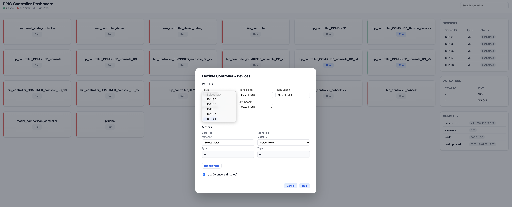

# Exo-Launcher
## Overview


- **Exo-Launcher** is an end-to-end system designed and developed as a Research Assistant & Software Engineer in Dr. Young’s *Exoskeleton and Prosthetic Intelligent Controls (EPIC) Lab*. 
- The tool provides a unified workflow for operating remote NVIDIA Jetson-based hip-exo controllers by combining automated Wi-Fi orchestration, SSH ControlMaster session management, profile handling, and real-time telemetry visualization. 
- By consolidating these steps into a single interface, the launcher removes the need for manual SSH commands, repeated authentication, and ad-hoc file transfers, enabling fast, reliable, and reproducible controller execution across the lab’s hardware.

## File Structure
```
EXO-LAUNCHER/
├── assets/               # CSS + JS
├── data/                 # JSON state + profiles
├── util/                 # Wi-Fi, SSH, API, profile helpers
├── login.html
├── dashboard.html
├── main.py               # entry point
├── setup_keys.py         # Authroize ssh w/o password
└── config.py             # Centralized configuration
```

## Key Features
### 1. SSH Control & Connectivity
- Persistent **ControlMaster** tunnel for low-latency commands  
- Automatic Wi-Fi sequencing (primary → fallback)  
- Profile-based Jetson connection management  

### 2. Real-Time Data Pipeline
- Continuous comparison/meta sync via a background thread  
- Single SSH batch command to minimize overhead  
- Atomic JSON writes for dashboard safety  

### 3. Lightweight Architecture
- Pure Python backend (http.server, threading, subprocess)  
- Static frontend (HTML/CSS/JS) served locally  
- No external dependencies or frameworks  

### 4. Controller Execution Engine
- API endpoints for run, stop, and flexible-run  
- Commands executed through the active ControlMaster session  

### 5. Operational Reliability
- Graceful shutdown: closes ControlMaster, thread, and servers  
- Robust error handling across SSH, network, and profile operations  

## How It Works
### 1. Start the Launcher
Run:

```bash
python3 launch.py
```

The launcher:
- Detects OS  
- Attempts Wi-Fi connection in a fixed priority order  
- Records the connected SSID  
- Starts two local servers (API on 8321, UI on 8000)  

The login page opens automatically in the browser.

### 2. Login & Profiles

The login UI supports:
- Selecting saved profiles  
- Creating new profiles  
- Saving credentials locally  

Profiles are stored in:

```
data/jetson_profiles.json
```

Testing a profile attempts an SSH handshake using a temporary ControlMaster session.

### 3. Establishing the Active Connection

When the user clicks **Login**:

- The API loads the selected profile  
- A persistent ControlMaster session is created:

```
ssh -M -N -f
```

- The launcher records the active user, host, and SSID  
- A background sync thread begins updating JSON state every few seconds  
- Frontend redirects to:

```
dashboard.html
```

### 4. Dashboard

The dashboard continuously reads:

```
data/comparison_output.json
data/meta.json
```

These files are refreshed through a single SSH round-trip that:

- Runs the Jetson comparison script  
- Pulls updated state  
- Mirrors the results locally  

Dashboard buttons call API endpoints to:

- Run a controller  
- Run with a flexible config  
- Stop a controller  

All actions reuse the active ControlMaster session for speed and stability.

### 5. Shutdown

Stopping the launcher:

- Closes the active ControlMaster  
- Stops the sync thread  
- Shuts down both servers cleanly  

## Tech Stack

### Backend (Python)

- `http.server` for API and static hosting  
- Threads for servers + periodic sync  
- SSH ControlMaster integration via subprocess  
- JSON-based state mirroring  
- Wi-Fi connection attempts via system calls  

### Frontend (HTML/CSS/JS)

- `login.html` and `dashboard.html`  
- Lightweight JavaScript for fetch calls and live polling  
- No frameworks or dependencies  

### Data Format
All state is stored in plain JSON under `data/`, including:

- Jetson profiles  
- Controller readiness info  
- Meta information for dashboard context  

